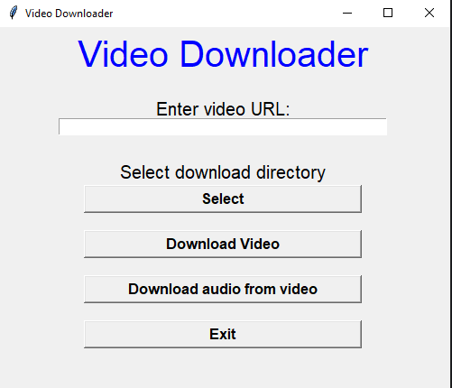

# Video Downloader

#### Video Downloader is a Python-based GUI application that allows users to download videos and audio from YouTube using the

***pytybefix*** library.

## Features

- **GUI:** Simple and intuitive graphical user interface built with Tkinter.
- **Video Downloading:** Download the highest resolution version of YouTube video.
- **Audio Extraction:** Extract and download only the audio stream from a YouTube video.
- **Logging:** Detailed logging of all actions and errors to facilitate debugging and improve user support.

